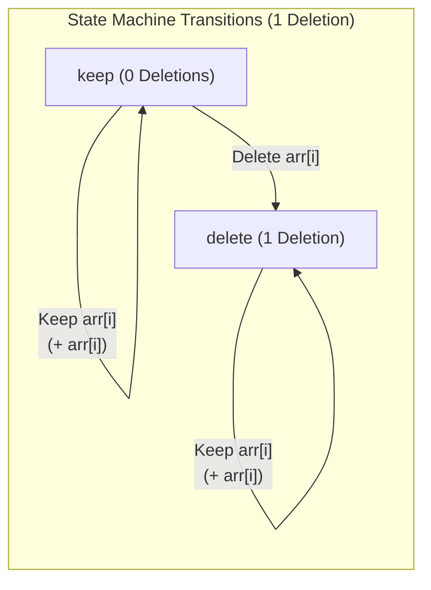
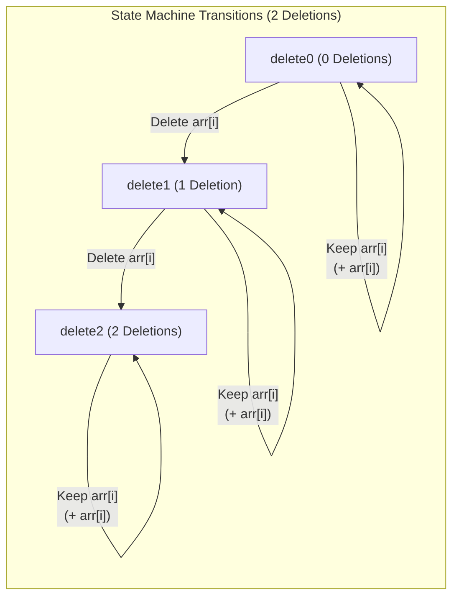
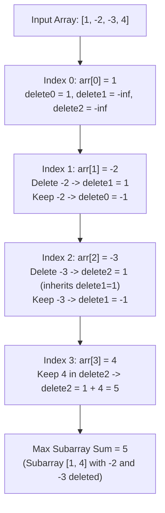

# [LeetCode 1186 - Maximum Subarray Sum with One Deletion](https://leetcode.com/problems/maximum-subarray-sum-with-one-deletion/)

- **Difficulty:** Medium
- **Topics:** Array, Dynamic Programming, Kadane's Algorithm

---

## Problem Description

Given an array of integers `arr`, return the maximum sum for a non-empty subarray with at most one element deletion. The resulting subarray must not be empty.

---

## Approach 1: Brute Force (Element Deletion Simulation)

### Intuition
Simulate deleting every element at index `delete_idx` one by one to form a new list `remaining`. For each deleted configuration, run a standard brute-force maximum subarray sum check.

### Code Implementation

```python
arr = [1, -2, 0, 3]


def max_subarray_sum(nums):
    """
    Finds the maximum subarray sum using brute force.
    Time: O(n²)
    """
    best = float("-inf")

    for start in range(len(nums)):
        current_sum = 0

        for end in range(start, len(nums)):
            current_sum += nums[end]
            best = max(best, current_sum)

    return best


def maximum_sum_with_one_deletion(arr):
    """
    Try deleting every element once and compute
    the maximum subarray sum.
    """
    answer = float("-inf")

    for delete_idx in range(len(arr)):
        remaining = arr[:delete_idx] + arr[delete_idx + 1:]
        answer = max(answer, max_subarray_sum(remaining))

    return answer


print(maximum_sum_with_one_deletion(arr))
```

### Complexity Analysis
- **Time Complexity:** $\mathcal{O}(N^3)$ — There are $N$ choices for the deleted index. Slicing takes $O(N)$ and computing maximum subarray sum via nested loops takes $O(N^2)$, resulting in $O(N \cdot N^2) = O(N^3)$.
- **Space Complexity:** $\mathcal{O}(N)$ — Additional space required to store the `remaining` array after slicing.

---

## Approach 2: Optimal Dynamic Programming (1 Deletion)

### Intuition and State Breakdown

Standard Kadane's algorithm finds the maximum subarray sum by keeping track of the max sum ending at each position. To handle **at most one deletion**, we extend this state tracking into two variables at each step:

1. **`keep`**: The maximum subarray sum ending at current index `i` with **zero** deletions (all elements kept).
2. **`delete`**: The maximum subarray sum ending at current index `i` with **exactly one** deletion performed.

---

### Pictorial State Machine (1 Deletion)



---

### State Transitions Explained

For every element `arr[i]` from index 1 to `len(arr) - 1`:

#### 1. Calculating `new_delete` (One deletion state):
```python
new_delete = max(keep, delete + arr[i])
```
There are two ways to achieve a subarray ending at index `i` with 1 element deleted:
- **Option A (`keep`)**: We choose to delete the current element `arr[i]`. Thus, we drop `arr[i]` entirely and inherit the previous subarray sum where no deletion had taken place yet (`keep`).
- **Option B (`delete + arr[i]`)**: We choose to keep the current element `arr[i]`, assuming an element was already deleted at an earlier position. Thus, we add `arr[i]` to the previous `delete` sum.

#### 2. Calculating `new_keep` (No deletion state):
```python
new_keep = max(arr[i], keep + arr[i])
```
This is the standard Kadane's transition:
- **Option A (`arr[i]`)**: Start a brand new subarray from index `i`.
- **Option B (`keep + arr[i]`)**: Extend the previous non-deleted subarray by adding `arr[i]`.

#### 3. Updating States and Global Answer:
```python
keep = new_keep
delete = new_delete
ans = max(ans, keep, delete)
```
After computing `new_keep` and `new_delete`, we update `keep` and `delete` for the next iteration and update `ans` with the maximum value across all states.

---

### Step-by-Step Execution Trace (1 Deletion)

**Input:** `arr = [1, -2, 0, 3]`

#### State Summary Table

| Index | Element | `keep` | `delete` | `ans` |
| :---: | :---: | :---: | :---: | :---: |
| 0 | `1` | 1 | `-inf` | 1 |
| 1 | `-2` | -1 | 1 | 1 |
| 2 | `0` | 0 | 1 | 1 |
| 3 | `3` | 3 | **4** | **4** |

---

#### Detailed Step-by-Step Iteration

- **Initialization (index 0, element = 1):**
  - `keep = 1`
  - `delete = -inf`
  - `ans = 1`

- **Iteration 1 (i = 1, element = -2):**
  - `new_delete = max(keep, delete + (-2)) = max(1, -inf) = 1` *(deleting -2)*
  - `new_keep = max(-2, 1 + (-2)) = -1`
  - `keep = -1`, `delete = 1`
  - `ans = max(1, -1, 1) = 1`

- **Iteration 2 (i = 2, element = 0):**
  - `new_delete = max(keep, delete + 0) = max(-1, 1 + 0) = 1` *(extending previous deletion)*
  - `new_keep = max(0, -1 + 0) = 0`
  - `keep = 0`, `delete = 1`
  - `ans = max(1, 0, 1) = 1`

- **Iteration 3 (i = 3, element = 3):**
  - `new_delete = max(keep, delete + 3) = max(0, 1 + 3) = 4` *(extending previous deletion with 3)*
  - `new_keep = max(3, 0 + 3) = 3`
  - `keep = 3`, `delete = 4`
  - `ans = max(1, 3, 4) = 4`

**Final Return Value:** `4` (subarray `[1, -2, 0, 3]` with `-2` deleted leaves `1 + 0 + 3 = 4`).

---

### Code Implementation (1 Deletion)

```python
class Solution:
    def maximumSum(self, arr: list[int]) -> int:
        if not arr:
            return 0

        keep = arr[0]
        delete = float("-inf")
        ans = arr[0]

        for i in range(1, len(arr)):
            new_delete = max(keep, delete + arr[i])
            new_keep = max(arr[i], keep + arr[i])

            keep = new_keep
            delete = new_delete

            ans = max(ans, keep, delete)

        return ans
```

---

### Complexity Analysis
- **Time Complexity:** $\mathcal{O}(N)$ — Single pass through the array of size $N$.
- **Space Complexity:** $\mathcal{O}(1)$ — Only constant extra space is used for state variables (`keep`, `delete`, `new_keep`, `new_delete`, `ans`).

---

## Approach 3: Extension to At Most 2 Deletions

### Problem Variant: Allowing 2 Deletions
What if the problem is extended to allow **at most two element deletions**? 

Instead of tracking 2 states (`keep` and `delete`), we expand our dynamic programming state into **3 states**:
1. **`delete0`**: Max subarray sum ending at index `i` with **0 deletions**.
2. **`delete1`**: Max subarray sum ending at index `i` with **1 deletion**.
3. **`delete2`**: Max subarray sum ending at index `i` with **2 deletions**.

---

### Pictorial State Machine (2 Deletions)



---

### Pictorial Execution Flow (`arr = [1, -2, -3, 4]`)



---

### State Transitions for 2 Deletions

For each element `arr[i]` starting from index 1:

1. **`new_delete2 = max(delete1, delete2 + arr[i])`**
   - **Delete current element `arr[i]`**: We drop `arr[i]`. This transitions from 1 previous deletion (`delete1`) to now having 2 deletions (`delete1`).
   - **Keep current element `arr[i]`**: Add `arr[i]` to a subarray where 2 deletions were already made (`delete2 + arr[i]`).

2. **`new_delete1 = max(delete0, delete1 + arr[i])`**
   - **Delete current element `arr[i]`**: We drop `arr[i]`, transitioning from 0 previous deletions (`delete0`) to 1 deletion (`delete0`).
   - **Keep current element `arr[i]`**: Add `arr[i]` to a subarray where 1 deletion was already made (`delete1 + arr[i]`).

3. **`new_delete0 = max(arr[i], delete0 + arr[i])`**
   - Standard Kadane's algorithm (start new subarray or extend current 0-deletion subarray).

---

### Step-by-Step Execution Trace (2 Deletions)

**Input:** `arr = [1, -2, -3, 4]`

#### State Summary Table (2 Deletions)

| Index | Element | `delete0` | `delete1` | `delete2` | `ans` |
| :---: | :---: | :---: | :---: | :---: | :---: |
| 0 | `1` | 1 | `-inf` | `-inf` | 1 |
| 1 | `-2` | -1 | 1 | `-inf` | 1 |
| 2 | `-3` | -3 | -1 | 1 | 1 |
| 3 | `4` | 4 | 3 | **5** | **5** |

---

#### Detailed Step-by-Step Iteration (2 Deletions)

- **Initialization (index 0, element = 1):**
  - `delete0 = 1`, `delete1 = -inf`, `delete2 = -inf`, `ans = 1`

- **Iteration 1 (i = 1, element = -2):**
  - `new_delete2 = max(-inf, -inf + (-2)) = -inf`
  - `new_delete1 = max(1, -inf + (-2)) = 1` *(deleting -2)*
  - `new_keep = max(-2, 1 + (-2)) = -1`
  - `delete0 = -1`, `delete1 = 1`, `delete2 = -inf`, `ans = 1`

- **Iteration 2 (i = 2, element = -3):**
  - `new_delete2 = max(1, -inf + (-3)) = 1` *(deleting -3 while -2 was already deleted)*
  - `new_delete1 = max(-1, 1 + (-3)) = -1` *(deleting -3 from 0-deletion state)*
  - `new_delete0 = max(-3, -1 + (-3)) = -3`
  - `delete0 = -3`, `delete1 = -1`, `delete2 = 1`, `ans = 1`

- **Iteration 3 (i = 3, element = 4):**
  - `new_delete2 = max(-1, 1 + 4) = 5` *(extending 2-deletion state with 4)*
  - `new_delete1 = max(-3, -1 + 4) = 3`
  - `new_delete0 = max(4, -3 + 4) = 4`
  - `delete0 = 4`, `delete1 = 3`, `delete2 = 5`
  - `ans = max(1, 4, 3, 5) = 5`

**Final Return Value:** `5` (Subarray `[1, -2, -3, 4]` with both `-2` and `-3` deleted leaves `1 + 4 = 5`).

---

### Code Implementation (2 Deletions)

```python
def maximum_sum_two_deletions(arr: list[int]) -> int:
    if not arr:
        return 0

    delete0 = arr[0]
    delete1 = float("-inf")
    delete2 = float("-inf")
    ans = arr[0]

    for i in range(1, len(arr)):
        new_delete2 = max(delete1, delete2 + arr[i])
        new_delete1 = max(delete0, delete1 + arr[i])
        new_delete0 = max(arr[i], delete0 + arr[i])

        delete0 = new_delete0
        delete1 = new_delete1
        delete2 = new_delete2

        ans = max(ans, delete0, delete1, delete2)

    return ans


# Example Test Case
print(maximum_sum_two_deletions([1, -2, -3, 4]))  # Output: 5
```

---

### Generalization to K Deletions

For **at most $K$ deletions**, we can generalize the solution using an array `dp` of size $K + 1$, where `dp[j]` represents the maximum subarray sum ending at current element with `j` deletions performed:

```python
def maximum_sum_k_deletions(arr: list[int], k: int) -> int:
    if not arr:
        return 0

    dp = [float("-inf")] * (k + 1)
    dp[0] = arr[0]
    ans = arr[0]

    for i in range(1, len(arr)):
        x = arr[i]
        new_dp = [float("-inf")] * (k + 1)

        # 0 deletions (Standard Kadane's)
        new_dp[0] = max(x, dp[0] + x)

        # 1 to K deletions
        for j in range(1, k + 1):
            new_dp[j] = max(dp[j - 1], dp[j] + x)

        dp = new_dp
        ans = max(ans, max(dp))

    return ans
```

- **Time Complexity for K Deletions:** $\mathcal{O}(N \cdot K)$
- **Space Complexity for K Deletions:** $\mathcal{O}(K)$

---

## Edge Cases and Pitfalls
- **All Negative Numbers**: e.g., `arr = [-1, -2, -3]`. Deleting the worst negative numbers leaves a single negative number (e.g., `-1`), which is correctly tracked across states.
- **Single Element Array**: e.g., `arr = [-5]`. Loop does not execute, returning `arr[0] = -5` directly (non-empty subarray requirement preserved).
